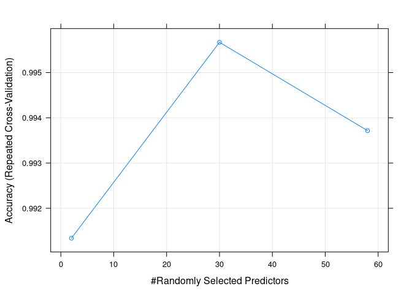
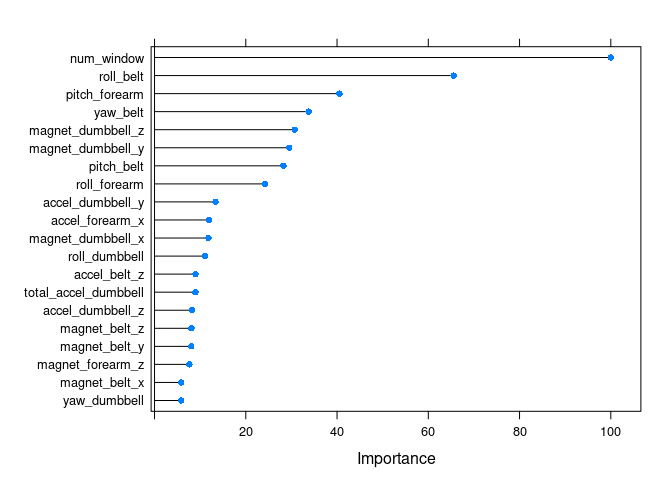
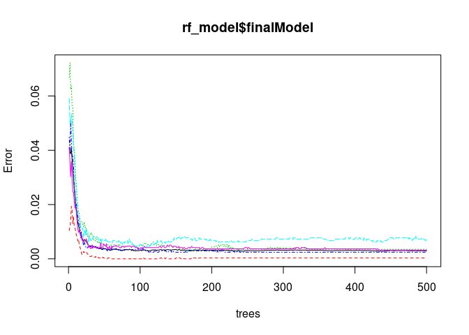

# Practical Machine Learning
April 11, 2017  

# Peer-graded Assignment: Prediction Assignment Writeup

A group of participants completed an excercise in various positions while wearing sensors that tracked their movment.
The positiion of the excercise is defined by the "classe" variable in the training set. The other variables are explanatory and come from the attached sensors.
The goal of the project is to predict the manner in which participants did the exercise using machine learning classification and then use that
model on new data to complete the 20 question final quiz.


Load the required libraries


```r
library(tidyverse)
library(caret)
library(randomForest)
library(kernlab)
library(doParallel)
```


Enabling parallel support for Caret

```r
cl <- makeCluster(2)
registerDoParallel(cl)
```

Here we'll download the data from the website.


```r
url <- "https://d396qusza40orc.cloudfront.net/predmachlearn/"
naStrings <- c("''","NA","#DIV/0!","")
train<-read.csv(sprintf("%spml-training.csv", url), na.strings = naStrings)
test<-read.csv(sprintf("%spml-testing.csv", url), na.strings = naStrings)
```

## Preparing the training data
We'll subset 60% of the training data to train the models, and reserve 40% to test them.


```r
inTrain <- createDataPartition(y=train$classe, p=0.6, list=FALSE)
training <- train[inTrain, ]
testing <- training[-inTrain, ]
```

We'll remove the row_id and timestamps; they're not needed for anything.


```r
training <- select(training, -X, -raw_timestamp_part_1, -raw_timestamp_part_2, -cvtd_timestamp)
```

### Transforming the Data

We don't want to use any variables that have low variance. They're just noise.


```r
nearZeroVars <- nearZeroVar(training, saveMetrics=TRUE)
nearZeroVars$feature <- rownames(nearZeroVars) 
nearZeroVars <- nearZeroVars %>% filter(nzv==FALSE)
training <- training[nearZeroVars$feature]
```

Likewise, anything with a lot of NA is pretty useless for us too. Let's get rid of any column with over 60% NA values.


```r
lowNA <- sapply(training, function(x) sum(is.na(x)/nrow(training))) %>% as.data.frame()
colnames(lowNA)=c("percentNA")
lowNA$feature <- rownames(lowNA)
lowNA<- filter(lowNA, percentNA<0.60)
training <- training[lowNA$feature]
```

We need to propagate our changes to the other data sets too, otherwise we'll have extra variables when we go to predict the classification. The -55 in the below R code is just so we drop the classe column from our testing set.


```r
testing <- testing[colnames(training)]
test <- test[colnames(training[,-55])]
```

## Generating the model 

Let's use a Random Forest model. We'll pre-process the data by centering and scaling it and use repeated 10-fold cross validation.
Caret makes this very easy to set up, but it'll take a while to run. That's why we enabled parallelization up above.


```r
rf_model<-train(classe~.,data=training,method="rf",
                trControl=trainControl(method="repeatedcv",number=5),
                prox=TRUE,allowParallel=TRUE,
                preProc=c("center", "scale"))
print(rf_model)
```

```
## Random Forest 
## 
## 11776 samples
##    54 predictor
##     5 classes: 'A', 'B', 'C', 'D', 'E' 
## 
## Pre-processing: centered (58), scaled (58) 
## Resampling: Cross-Validated (5 fold, repeated 1 times) 
## Summary of sample sizes: 9421, 9420, 9422, 9421, 9420 
## Resampling results across tuning parameters:
## 
##   mtry  Accuracy   Kappa    
##    2    0.9913382  0.9890425
##   30    0.9956688  0.9945213
##   58    0.9937159  0.9920507
## 
## Accuracy was used to select the optimal model using  the largest value.
## The final value used for the model was mtry = 30.
```

```r
print(rf_model$finalModel)
```

```
## 
## Call:
##  randomForest(x = x, y = y, mtry = param$mtry, proximity = TRUE,      allowParallel = TRUE) 
##                Type of random forest: classification
##                      Number of trees: 500
## No. of variables tried at each split: 30
## 
##         OOB estimate of  error rate: 0.3%
## Confusion matrix:
##      A    B    C    D    E  class.error
## A 3347    1    0    0    0 0.0002986858
## B    4 2271    4    0    0 0.0035103115
## C    0    5 2049    0    0 0.0024342746
## D    0    0   13 1916    1 0.0072538860
## E    0    0    0    7 2158 0.0032332564
```

```r
plot(rf_model)
```

<!-- -->

```r
plot(varImp(rf_model), top = 20)
```

<!-- -->

```r
plot(rf_model$finalModel)
```

<!-- -->

## Predicting the classification


```r
testing$prediction<-predict(rf_model, newdata = select(testing, -classe))
testing<-mutate(testing, Test=ifelse(classe==prediction,1,0))
print(sprintf("There were %s correct predictions out of %s; %s Percent",sum(testing$Test),nrow(testing),100 * sum(testing$Test)/nrow(testing)))
```

```
## [1] "There were 4699 correct predictions out of 4699; 100 Percent"
```

Our results seem pretty good. Let's try it out on the project test set.


```r
testPrediction<-predict(rf_model, newdata = test)
```

After submitting, all 20 observations were correctly predicted.


